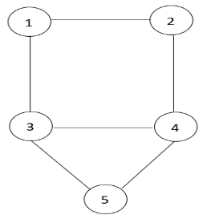

# Quantum Bridge Analytics I : a tutorial on formulating and using QUBO models

## 1 Basic QUBO Problem Formulation

$$
QUBO: \quad minimize/maxmize \quad y = x^t Q x
$$

其中x是一个二元决策变量的向量，Q是一个常数方阵.

通常假设Q矩阵是对称的或者是上三角形式的，

对称形式：$𝑞_{ij} = (𝑞_{ij} + 𝑞_{ji})/2, i \neq j$ .

上三角形式：
$$
q_{ij}=\left\{\begin{matrix}
𝑞_{ij} + 𝑞_{ji}, \quad j > i\\ 
0, \qquad \qquad j < i
\end{matrix}\right.
$$

## 2 Illustrative Examples and Definitions

首先，考虑优化问题，
$$
Minimize \quad y = -5x_1-3x_2-8x_3-6x_4+4x_1x_2+8x_1x_3+2x_2x_3+10x_3x_4
$$

1. 待最小化的函数是一个关于二元变量的二次函数.

2. 由于二元变量满足$x_j = x_j^2$，线性部分可以写为
   $$
   -5x_1^2-3x_2^2-8x_3^2-6x_4^2
   $$
   
3. 然后我们可以将模型改写为如下矩阵形式：
   $$
   Minimize \quad y = (x_1& x_2& x_3&x_4)
   \begin{bmatrix}
   -5&2&4&0\\
   2&-3&1&0\\
   4&1&-8&5\\
   0&0&5&-6
   \end{bmatrix}
   \begin{bmatrix}
   x_1\\
   x_2\\
   x_3\\
   x_4
   \end{bmatrix}
   $$
   
4. 对应前文矩阵形式
   $$
   Minimize\quad y = x^t Q x
   $$
   在这种情况下，Q已经关于主对角线对称，不需要通过第一节的方法修改系数.

5. 除了对决策变量的0 / 1限制外，QUBO是一个无约束模型，所有问题数据都包含在Q矩阵中.

6. 上述3.中模型的解为：$y=-11,x_1=x_4=1,x_2=x_3=0$.

## 3 Natural QUBO Formulations

提供了两个重要应用的例子，它们的公式自然地采取了QUBO模型的形式.

### 3.1 The Number Partitioning Problem 数分割问题

将一组数字划分为两个子集，使得子集和尽可能接近.

考虑一组数$S=\{s_1,s_2,\dots,s_m\}$. 令$x_j=1$表示$s_j$分配给子集$1$；$x_j=0$表示$s_j$分配给子集$2$. 则子集$1$的和为$sum_1 = \sum_{j=1}^{m}s_jx_j$，子集$2$的和为$sum_2 = \sum_{j=1}^{m}s_j - \sum_{j=1}^{m}s_jx_j$. 子集和之差为
$$
diff = sum_2 - sum_1 = \sum_{j=1}^{m}s_j - 2\sum_{j=1}^{m}s_jx_j = c - 2\sum_{j=1}^{m}s_jx_j
$$
为使差值最小化，需最小化
$$
diff^2 = \Big\{c - 2\sum_{j=1}^{m}s_jx_j\Big\}^2 = c ^ 2 + 4x^t Q x
$$

其中，
$$
q_{ii} = s_i(s_i-c)  \qquad q_{ij}=q_{ji} = s_is_j
$$

> $$
> diff^2 = \Big\{c - 2\sum_{j=1}^{m}s_jx_j\Big\}^2 = 
> c ^ 2 - 4c\sum_{j=1}^{m}s_jx_j+4\Big(\sum_{j=1}^{m}s_jx_j\Big)^2 = 
> c ^ 2 + 4 \Big\{ \Big(\sum_{j=1}^{m}s_jx_j\Big)^2 - c\sum_{j=1}^{m}s_jx_j \Big\}
> $$
>
> $$
> \Big(\sum_{j=1}^{m}s_jx_j\Big)^2 - c\sum_{j=1}^{m}s_jx_j = 
> \sum_{j=1}^{m}s_j^2x_j^2 + \sum_{i=1}^{m}\sum_{j=1}^{m}s_is_jx_ix_j - c\sum_{j=1}^{m}s_jx_j
> $$
>
> 由于$x_j = x_j^2$，
> $$
> \Big(\sum_{j=1}^{m}s_jx_j\Big)^2 - c\sum_{j=1}^{m}s_jx_j = 
> \sum_{j=1}^{m}(s_jx_j)^2 + \sum_{i=1}^{m}\sum_{j=1}^{m}s_is_jx_ix_j - c\sum_{j=1}^{m}s_jx_j^2 =
> \sum_{j=1}^{m}\Big\{(s_jx_j)^2-cs_jx_j^2\Big\} + \sum_{i=1}^{m}\sum_{j=1}^{m}s_is_jx_ix_j = 
> \sum_{j=1}^{m}s_j(s_j-c)x_j^2 + \sum_{i=1}^{m}\sum_{j=1}^{m}s_is_jx_ix_j = 
> \sum_{i=1}^{m}q_{ii}x_i^2 + \sum_{i=1}^{m}\sum_{j=1}^{m}q_{ij}x_ix_j = 
> x^t Q x
> $$

去除加法和乘法常数后，优化问题变为：
$$
QUBO: \quad min \quad y = x^t Q x
$$
### 3.2 The Max-Cut Problem最大割问题

给定一个无向图G(V, E)，其中V为顶点集，E为边集，最大割问题旨在将V划分为两个集合，使得两个集合之间的边的数量（被切割的边）尽可能多。

令$x_j=1$表示点$j$在集合$1$中；$x_j=0$表示点$j$分配在集合$2$中.  则$x_i \oplus x_j = x_i + x_j -  x_ix_j = 0$时表示点$i,j$是同一集合中；$x_i \oplus x_j = x_i + x_j -  x_ix_j = 1$时表示边$(i,j)$为割. 

因此，最大化割中边数的问题可以表述为，
$$
Maximize \quad y = \sum_{(i.j)\in E}(x_i+x_j-2x_ix_j)
$$
**举例：**如下具有5个顶点和6条边的无向图. 

显式地考虑图中的所有边，给出下面的公式：
$$
Maximize \quad y = (x_1+x_2-2x_1x_2) + (x_1+x_3-2x_1x_3) + (x_2+x_4-2x_2x_4) + (x_3+x_4-2x_3x_4) + (x_3+x_5-2x_3x_5) + (x_4+x_5-2x_4x_5)
$$
或，
$$
max \quad y = 2x_1+2x_2+3x_3+3x_4+2x_5-2x_1x_2-2x_1x_3-2x_2x_4-2x_3x_4-2x_3x_5-2x_4x_5
$$
表示为对称矩阵Q：
$$
Q = 
\begin{bmatrix}
2 & -1 & -1 &  0 & 0 \\
-1 & 2 & 0 &  -1 & 0 \\
-1 & 0 & 3 &  -1 & -1 \\
0 & -1 & -1 &  3 & -1 \\
0 & 0 & -1 &  -1& 2 \\
\end{bmatrix}
$$
求解该QUBO模型得$x = ( 0,1,1,0,0)$。因此，顶点2和3在一个集合中，顶点1，4和5在另一个集合中，最大切割值为5。

## 4 Creating QUBO Models Using Known Penalties

通过在目标函数中引入<u>二次惩罚项</u>，约束模型可以有效地重新建模为QUBO模型，以替代显式施加约束。

下表给出了一些常见约束转化为惩罚项的例子. <u>所有变量均为二元变量</u>，参数P是一个正的标量惩罚值. 

|      经典约束      |        等价惩罚项         |
| :----------------: | :-----------------------: |
|     $x+y\le 1$     |          $P(xy)$          |
|    $x+y \ge 1$     |       $P(1-x-y+xy)$       |
|      $x+y=1$       |      $P(1-x-y+2xy)$       |
|      $x\le y$      |         $P(x-xy)$         |
| $x_1+x_2+x_3 \le1$ | $P(x_1x_2+x_1x_3+x_2x_3)$ |
|       $x=y$        |       $P(x+y-2xy)$        |

以一个传统形式的约束为例，
$$
Min \quad y  = f(x)
$$

$$
s.t. \quad x_1+x_2 \le 1
$$

等价于，
$$
minimize \quad y = f(x) + Px_1x_2
$$
其中P为充分大的正标量。如果$f ( x )$是线性或二次的，那么这个无约束模型将是QUBO模型的形式。

### 4.1 The Minimum Vertex Cover (MVC) Problem 最小顶点覆盖问题

图的**覆盖**是一个顶点的集合，使图中的每一条边都至少连结该集合中的一个顶点。

给定一个顶点集为V，边集为E的无向图. 令$x_j=1$表示点$j$在覆盖中；$x_j=0$表示点$j$不在覆盖中.  优化模型为，
$$
Minimize \quad \sum_{j\in V}x_j
$$

$$
s.t. \qquad x_i + x_j \ge 1, \quad \forall (i,j) \in E
$$

约束条件保证每条边的端点至少有一个在覆盖中. 需要注意的是，对图中的每条边都有一个约束. 每个约束都将通过在等效QUBO模型中的目标函数中添加一个惩罚项来交替施加. 因此，MVC的约束模型的一个无约束替代方案如下，
$$
Minimize \quad y = \sum_{j\in V}x_j + P(\sum_{(i,j) \in E}(1-x_i-x_j+x_ix_j))
$$
该问题的一个常见扩展是允许一个权重$w_j$与每个顶点j相关联。加权顶点覆盖问题的QUBO模型：
$$
Minimize \quad y = \sum_{j\in V}w_jx_j + P(\sum_{(i,j) \in E}(1-x_i-x_j+x_ix_j))
$$
**举例：**如下具有5个顶点和6条边的无向图. 

模型如下，
$$
Minimize \quad y = & x_1+x_2+x_3+x_4+x_5+\\
&  P(1-x_1-x_2+x_1x_2)+ \\
&  P(1-x_1-x_3+x_1x_3)+ \\
&  P(1-x_2-x_4+x_2x_4)+ \\
&  P(1-x_3-x_4+x_3x_4)+ \\
&  P(1-x_3-x_5+x_3x_5)+ \\
&  P(1-x_4-x_5+x_4x_5)
$$
任意选择 P 等于 8，并且去除加法常数$(6P = 48)$，得到 QUBO 模型,
$$
QUBO: \quad min \quad x^t Q x
$$

$$
Q = 
\begin{bmatrix}
-15 & 4 & 4 & 0 & 0 \\
4 & -15 & 0 & 4 & 4 \\
4 & 0 & -23 & 4 & 4 \\
0 & 4 & 4 & -23 & 4 \\
0 & 0 & 4 & 4 & -15 \\
\end{bmatrix}
$$

求解该QUBO模型得到：在$x = ( 0,1,1,0,1)$处，$x^T Qx = -45$，其中$y = 48-45 = 3$，这意味着最小覆盖由节点2，3和5给出。容易检验，在该解处，所有的惩罚项都等于0。

**关于惩罚项系数：**

对于这个标量P必须给出一个数值，但并不是唯一的.  通常情况下，对所有约束使用相同的惩罚项系数，但对不同的约束可以使用不同的. 如果一个约束必须绝对满足，那么P必须足够大. 然而，有些约束轻微的违反是可以容忍的。对于这类案件，一个较为温和的P值就足够了.

过大的P值会阻碍求解过程，因为惩罚项淹没了原始目标函数的信息，难以区分一个解和另一个解的质量.  另一方面，过小的P值不利于可行解的搜索. 

### 4.2 The Set Packing Problem 集合覆盖问题(*有脑部成分*)

集合覆盖问题要求选择尽可能多的集合，使得这些选中的集合之间没有公共元素，即它们是互斥的。

一般形式为，
$$
max \quad & \sum_{j=1}^n w_jx_j \\
s.t. & \sum_{j=1}^{n}a_{ij}x_j \le 1 & for & i = 1,\dots,m
$$
其中，系数$a_{ij}$为$0/1$. (*我的理解是，元素i出现在集合j中时为1*)

**举例：**

*<u>自行脑补的题干：</u>*

*集合1: {1,2}*

*集合2:{2}*

*集合3:{1}*

*集合4:{1}*
$$
max & x_1 + x_2+x_3+x_4 \\
$$

$$
s.t. & x_1 & & + x_3 & + x_4 & \le 1\\
&x_1 &  + x_2 & & & \le 1
$$

这里所有目标函数系数$w_j$的值都为1，等价无约束形式为，
$$
max & x_1 + x_2  + x_3 + x_4 - Px_1x_3 - Px_1x_4 - Px_3x_4 - Px_1x_2\\
$$

$$
Q = 
\begin{bmatrix}
1 & -3 & -3 & -3 \\
-3 & 1 & 0 & 0 \\
-3 & 0 & 1 & -3 \\
-3 & 0 & -3 & 1 
\end{bmatrix}
$$

求解QUBO模型得$y = 2$，在$x = ( 0,1,1,0)$处。在这个解中，四个惩罚项都等于零。

#### 4.3 The Max 2-Sat Problem 最大2-SAT问题

最大2-SAT问题（The Max 2-Sat Problem）是一种布尔满足性问题（Boolean satisfiability problem），其中给定一组布尔变量和对应的逻辑子句，目标是找到一种变量赋值方式，使得满足尽可能多的逻辑子句. 对于最大2-SAT问题，每个子句由两个文字组成，如果其中一个或两个文字都为真，则满足子句.

对于这个问题有三种可能的子句类型，每种类型都有一个传统的约束，如果子句是真的，则必须满足这个约束. 

1. <u>No negations:</u> $(x_i \or x_j)$

   传统约束: $x_i+x_j \ge 1$

   二次惩罚项: $(1-x_i-x_j+x_ix_j)$

2. <u>One negation:</u> $(x_i \or \bar{x}_j)$

   传统约束: $x_i+\bar{x}_j \ge 1$

   二次惩罚项: $(x_j-x_ix_j)$

3. <u>Two negations:</u> $(\bar{x}_i \or \bar{x}_j)$

   传统约束: $\bar{x}_i+\bar{x}_j \ge 1$

   二次惩罚项: $(x_ix_j)$

(将$\bar{x}_i$替换为$1-\bar{x}_i$后化简不等式再查表.)

可以通过等价地最小化不满足的子句数量来逼近子句数量最大化问题。

**举例:**

|           子句            |      二次惩罚项      |
| :-----------------------: | :------------------: |
|       $x_1 \or x_2$       | $(1-x_1-x_2+x_1x_2)$ |
|    $x_1 \or \bar{x}_2$    |    $(x_2-x_1x_2)$    |
|    $\bar{x}_1 \or x_2$    |    $(x_1-x_1x_2)$    |
| $\bar{x}_1 \or \bar{x}_2$ |      $(x_1x_2)$      |
|    $\bar{x}_1 \or x_3$    |    $(x_1-x_1x_3)$    |
| $\bar{x}_1 \or \bar{x}_3$ |      $(x_1x_3)$      |
|    $x_2 \or \bar{x}_3$    |    $(x_3-x_2x_3)$    |
|       $x_2 \or x_4$       | $(1-x_2-x_4+x_2x_4)$ |
|    $\bar{x}_2 \or x_3$    |    $(x_2-x_2x_3)$    |
| $\bar{x}_2 \or \bar{x}_3$ |      $(x_2x_3)$      |
|       $x_3 \or x_4$       | $(1-x_3-x_4+x_3x_4)$ |
| $\bar{x}_3 \or \bar{x}_4$ |      $(x_3x_4)$      |

将二次惩罚项加在一起给出QUBO模型,
$$
min \quad y = 3 + x_1 - 2 x_4 -x_2x_3 + x_2x_4 + 2x_3x_4
$$

$$
Q = 
\begin{bmatrix}
1 & 0 & 0 & 0 \\
0 & 0 & -\frac{1}{2} & \frac{1}{2} \\
1 & -\frac{1}{2} & 0 & 1 \\
1 & \frac{1}{2} & 1 & -2 \\
\end{bmatrix}
$$

求解QUBO得到：在$x_1 = x_2 = x_3 = 0，x_4 = 1$处$y = 3-2 = 1$，意味着只有一个子句不满足.

由上, 得到的待求解QUBO模型的大小与问题中子句的个数无关，仅由变量的个数决定.

## 5 Creating QUBO Models: A General Purpose Approach

### Transformation # 1

$$
min \quad y = x^tCx \\
s.t. \ \ Ax = b, \quad x \  binary
$$

约束条件$Ax = b$转化为二次惩罚项$P( Ax-b) ^t ( Ax-b)$, 得到
$$
y = x^tCx + P( Ax-b) ^t ( Ax-b) = x^tCt+x^tDx+c = x^tQx+c
$$

### Transformation # 2

$$
(x_i+x_j \le 1) \rightarrow P(x_ix_j)
$$

### 5.1 Set Partitioning 集合划分问题

集合划分问题( SPP )是指将一组项划分为子集，使得每个项恰好出现在一个子集上，并使得所选子集的代价最小。
$$
min \sum_{j=1}^{n}c_jx_j \\
s.t.  \sum_{j=1}^{n}a_{ij}x_j=1 \ for \ i = 1,\dots,m
$$
其中, $x_j$表示是否选择子集j, $c_j$为子集的成本, 系数$a_{ij}$为0或1, 表示变量$x_j$受否显式出现在约束$i$中.  该模型符合Transformation # 1.

**举例:**
$$
min \ y = 3x_1+2x_2+x_3+x_4+3x_5+2x_6
$$

$$
s.t. & x_1+x_3+x_6 = 1 \\
& x_2+x_3+x_5+x_6=1 \\
& x_3+x_4+x_5=1 \\
& x_1+x_2+x_4+x_6 = 1
$$

添加二次惩罚项, 
$$
min \ y  =  & 3x_1+2x_2+x_3+x_4+3x_5+2x_6 \\
& + P(x_1+x_3+x_6-1)^2 + P(x_2+x_3+x_5+x_6-1)^2 \\
& + P(x_3+x_4+x_5-1)^2 + P(x_1+x_2+x_4+x_6-1)^2
$$
任意取$P=10$, 令$x_j = x_j^2$
$$
Q = 
\begin{bmatrix}
-17 & 10 & 10 & 10 & 0 & 20 \\
10 & -18 & 10 & 10 & 10 & 20 \\
10 & 10 & -29 & 10 & 20 & 20 \\
10 & 10 & 10 & -19 & 10 & 10 \\
0 & 10 & 20 & 10 & -17 & 10 \\
20 & 20 & 20 & 10 & 10 & -28 
\end{bmatrix}
$$
求解该QUBO方程得到最优解$x1 = x_5 = 1$(其他变量均为0)，从而得到$y = 6$。

<u>集合划分模型的特殊性质为构造QUBO模型提供了一种可以替代Transformation # 1的方法. $k_j$表示约束矩阵A中第$j$列中$1$的个数. $r_{ij}$表示变量$i$和$j$出现在同一约束中的次数. 则Q的对角元素$q_{ii}=c_i-Pk_i$, 非对角元素$q_{ij} = q_{ji} = Pr_{ij}$.</u>

### 5.2 Graph Coloring 图着色问题

顶点着色问题寻求给图中的节点分配颜色，使得相邻节点收到不同的颜色。K-着色问题试图找到恰好使用K种颜色的着色。从频率分配问题到印制电路板设计问题，广泛的应用都可以用K-着色模型来表示.

如果节点$i$被赋予颜色$j$, 则$x_{ij}=1$. 由于每个节点必须着色, 有约束
$$
\sum_{j=1}^{K}x_{ij}=1 \ i = 1,\dots, n
$$
其中n为图中节点的个数, 该约束保证一个颜色只能分配给一个节点。
$$
x_{ip}+x_{jp}\le 1 \ p = 1,\dots,K, \\ \forall (i,j) \in E
$$

该约束保证相邻节点分配不同颜色. 

通过在节点分配约束上使用Transformation # 1，在邻接约束上使用Transformation # 2，可以将该问题转化为QUBO模型的形式.  问题在其原始形式中没有目标函数，这意味着重点是使用允许的K种颜色找到一个可行的着色.  

**举例:**考虑如下图使用$K = 3$种颜色找到可行染色的问题。

$$
x_{i1}+x_{i2}+x_{i3} = 1 \quad i = 1,\dots,5 \\
x_{ip}+x_{jp} \le 1 \quad p = 1,\dots,3 \quad \forall (i,j) \in E
$$
在传统形式下, 该模型一共有$15(5*3)$个变量和$26(5+21)$个约束条件. 

为了便于标记和与早期的应用保持一致，首先使用单个下标对变量重新编号，从1到15，如下所示：
$$
(x_{11},x_{12},x_{13},x_{21},x_{22},\dots,x_{52},x_{53})=(x_1,x_2,\dots,x_{15})
$$
首先, 对节点分配约束使用Transformation # 1.
$$
&P(x_1+x_2+x_3-1) ^2& \rightarrow &P(-x_1-x_2-x_3+2x_1x_2+2x_1x_3+2x_2x_3) + P \\
&P(x_4+x_5+x_6-1) ^2& \rightarrow &P(-x_4-x_5-x_6+2x_4x_5+2x_4x_6+2x_5x_6) + P \\
&P(x_7+x_8+x_9-1) ^2& \rightarrow &P(-x_7-x_8-x_9+2x_7x_8+2x_7x_9+2x_8x_9) + P \\
&P(x_{10}+x_{11}+x_{12}-1) ^2& \rightarrow &P(-x_{10}-x_{11}-x_{12}+2x_{10}x_{11}+2x_{10}x_{12}+2x_{11}x_{12}) + P \\
&P(x_{13}+x_{14}+x_{15}-1) ^2& \rightarrow &P(-x_{13}-x_{14}-x_{15}+2x_{13}x_{14}+2x_{13}x_{15}+2x_{14}x_{15}) + P \\
$$
取$P=4$. 
$$
Q = 
\begin{bmatrix}
-4 & 4 & 4 & 0 & 0 & 0 & 0 & 0 & 0 & 0 & 0 & 0 & 0 & 0 & 0 \\
4 & -4 & 4 & 0 & 0 & 0 & 0 & 0 & 0 & 0 & 0 & 0 & 0 & 0 & 0 \\
4 & 4& -4 & 0 & 0 & 0 & 0 & 0 & 0 & 0 & 0 & 0 & 0 & 0 & 0 \\
0 & 0 & 0 & -4 & 4 & 4 & 0 & 0 & 0 & 0 & 0 & 0 & 0 & 0 & 0 \\
0 & 0 & 0 & 4 & -4 & 4 & 0 & 0 & 0 & 0 & 0 & 0 & 0 & 0 & 0 \\
0 & 0 & 0 & 4 & 4 & -4 & 0 & 0 & 0 & 0 & 0 & 0 & 0 & 0 & 0 \\
0 & 0 & 0 & 0 & 0 & 0 & -4 & 4 & 4 & 0 & 0 & 0 & 0 & 0 & 0 \\
0 & 0 & 0 & 0 & 0 & 0 & 4 & -4 & 4 & 0 & 0 & 0 & 0 & 0 & 0 \\
0 & 0 & 0 & 0 & 0 & 0 & 4 & 4 & -4 & 0 & 0 & 0 & 0 & 0 & 0 \\
0 & 0 & 0 & 0 & 0 & 0 & 0 & 0 & 0 & -4 & 4 & 4 & 0 & 0 & 0 \\
0 & 0 & 0 & 0 & 0 & 0 & 0 & 0 & 0 & 4 & -4 & 4 & 0 & 0 & 0 \\
0 & 0 & 0 & 0 & 0 & 0 & 0 & 0 & 0 & 4 & 4 & -4 & 0 & 0 & 0 \\
0 & 0 & 0 & 0 & 0 & 0 & 0 & 0 & 0 & 0 & 0 & 0 & -4 & 4 & 4 \\
0 & 0 & 0 & 0 & 0 & 0 & 0 & 0 & 0 & 0 & 0 & 0 & 4 & -4 & 4 \\
0 & 0 & 0 & 0 & 0 & 0 & 0 & 0 & 0 & 0 & 0 & 0 & 4 & 4 & -4 
\end{bmatrix}
$$
然后对邻接约束使用Transformation # 2
$$
(x_{1}+x_{4} \le 1) \rightarrow P(x_{1}x_{4})\\
(x_{2}+x_{5} \le 1) \rightarrow P(x_{2}x_{5})\\
(x_{3}+x_{6} \le 1) \rightarrow P(x_{3}x_{6})\\
\cdots
$$
$P=4$，因此在矩阵对角线两侧的对应位置分别插入惩罚值$2$. 
$$
Q = 
\begin{bmatrix}
-4 & 4 & 4 & 2 & 0 & 0 & 0 & 0 & 0 & 0 & 0 & 0 & 2 & 0 & 0 \\
4 & -4 & 4 & 0 & 2 & 0 & 0 & 0 & 0 & 0 & 0 & 0 & 0 & 2 & 0 \\
4 & 4& -4 & 0 & 0 & 2 & 0 & 0 & 0 & 0 & 0 & 0 & 0 & 0 & 2 \\
2 & 0 & 0 & -4 & 4 & 4 & 2 & 0 & 0 & 2 & 0 & 0 & 2 & 0 & 0 \\
0 & 2 & 0 & 4 & -4 & 4 & 0 & 2 & 0 & 0 & 2 & 0 & 0 & 2 & 0 \\
0 & 0 & 2 & 4 & 4 & -4 & 0 & 0 & 2 & 0 & 0 & 2 & 0 & 0 & 2 \\
0 & 0 & 0 & 2 & 0 & 0 & -4 & 4 & 4 & 2 & 0 & 0 & 0 & 0 & 0 \\
0 & 0 & 0 & 0 & 2 & 0 & 4 & -4 & 4 & 0 & 2 & 0 & 0 & 0 & 0 \\
0 & 0 & 0 & 0 & 0 & 2 & 4 & 4 & -4 & 0 & 0 & 2 & 0 & 0 & 0 \\
0 & 0 & 0 & 2 & 0 & 0 & 2 & 0 & 0 & -4 & 4 & 4 & 2 & 0 & 0 \\
0 & 0 & 0 & 0 & 2 & 0 & 0 & 2 & 0 & 4 & -4 & 4 & 0 & 2 & 0 \\
0 & 0 & 0 & 0 & 0 & 2 & 0 & 0 & 2 & 4 & 4 & -4 & 0 & 0 & 2 \\
2 & 0 & 0 & 2 & 0 & 0 & 0 & 0 & 0 & 2 & 0 & 0 & -4 & 4 & 4 \\
0 & 2 & 0 & 0 & 2 & 0 & 0 & 0 & 0 & 0 & 2 & 0 & 4 & -4 & 4 \\
0 & 0 & 2 & 0 & 0 & 2 & 0 & 0 & 0 & 0 & 0 & 2 & 4 & 4 & -4 
\end{bmatrix}
$$
求解该模型得到可行染色：$x2 = x4 = x9 = x_{11} = x_{15} = 1$，其他变量均为零。回到原来的变量，这个解意味着节点1-颜色# 2，节点2-颜色# 1，节点3和5-颜色# 3。

### 5.3 General 0/1 Programming 一般的0/1规划问题

带有不等式约束的问题总是可以通过引入松弛变量，并将松弛变量表示为二进制展开形式，转化为无约束形式. 

例如, $4x_1+5x_2-x_3\le 6$引入松弛变量$s$为$4x_1+5x_2-x_3+s= 6$. 考虑$x_3$, 显然$s\le7$. $s$可以用二元展开式$s_1+2s_2+4s_3$表示. 如果另外知道$x_1,x_2$都不可能为0时, 那$s \le 3$, 并且可以用展开式$s_1+2s_2$表示. 

**举例：**
$$
max & 6x_1+4x_2+8x_3+5x_4+5x_5 \\
s.t. & 2x_1+2x_2+4x_3+3x_4+2x_5 \le 7 \\
& x_1+2x_2+2x_3+x_4+2x_5 = 4 \\
& 3x_1+3x_2+2x_3+4x_4+4x_5 \ge 5 \\
& x\in\{0,1\}
$$
由于Transformation # 1要求所有约束都是方程而不是不等式，通过二元展开将松弛变量纳入，将第1和第3个约束转换为方程. 
$$
2x_1+2x_2+4x_3+3x_4+2x_5 \le 7 \rightarrow 2x_1+2x_2+4x_3+3x_4+2x_5 +s_1 =  7\\
3x_1+3x_2+2x_3+4x_4+4x_5 \ge 5 \rightarrow 3x_1+3x_2+2x_3+4x_4+4x_5-s_2 = 5
$$
结合约束1和约束2，约束3和约束2有，
$$
x_1+2x_3+x_4+s_1 = 3\\
2x_1+x_2+3x_4+2x_5-s_2 = 1
$$
因此
$$
0\le s_1 \le 3  \Rightarrow s_1 = x_6 + 2 x_7 \\
0\le s_2 \le 7  \Rightarrow s_2 = x_8 + 2 x_9 + 4x_{10}
$$
得到$Ax=b$的$A$，
$$
A = 
\begin{bmatrix}
2&2&4&3&2&1&2&0&0&0\\
1&2&2&1&2&0&0&0&0&0\\
3&3&2&4&4&0&0&-1&-2&-4\\
\end{bmatrix}
$$
使用Transformation # 1将问题重新表示为QUBO实例. 
$$
\begin{align*}
\max \ y = & 6x_1+4x_2+8x_3+5x_4+5x_5 \\
& -P(2x_1+2x_2+4x_3+3x_4+2x_5+x_6+2x_7-7)^2 \\
& -P(x_1+2x_2+2x_3+x_4+2x_5 - 4)^2 \\
& -P(3x_1+3x_2+2x_3+4x_4+4x_5-x_8-2x_9-4x_{10} - 5)^2
\end{align*}
$$
取$P = 10$，并改写为QUBO，常数为$- 900$，
$$
Q = 
\begin{bmatrix}
526 &−150 &−160 &−190 &−180 &−20 &−40 &30 &60 &120 \\
−150 &574 &−180 &−200 &−200 &−20 &−40 &30 &60 &120 \\
−160 &−180 &688 &−220 &−200 &−40 &−80 &20 &40 &80 \\
−190 &−200 &−220 &645 &−240 &−30 &−60 &40 &80 &160 \\
−180 &−200 &−200 &−240 &605 &−20 &−40 &40 &80 &160 \\
−20 &−20 &−40 &−30 &−20 &130 &−20 &0 &0 &0 \\
−40 &−40 &−80 &−60 &−40 &−20 &240 &0 &0 &0 \\
30 &30 &20 &40 &40 &0 &0 &−110 &−20 &−40 \\
60 &60 &40 &80 &80 &0 &0 &−20 &−240 &−80 \\
120 &120 &80 &160 &160 &0 &0 &−40 &−80 &−560
\end{bmatrix}
$$
得到，
$$
x_1=x_4=x_5=x_9=x_{10}=1, \ y = 916
$$
目标函数值为$16$.

### 5.4 Quadratic Assignment 二次分配问题

给定了n个设施和n个位置，以及表示设施i和j之间物流的流量矩阵（$𝑓_{ij}$）。距离矩阵（$𝑑_{ij}$）指定了位置i和j之间的距离. 优化问题是找到一种将设施分配给位置的方案，以最小化整个系统中的加权流量. 在某些应用中，可以显式引入成本信息来得到成本最小化模型。决策变量为$𝑥_{ij}= 1$，如果将设施i分配给位置j，则$𝑥_{ij}= 0$.
$$
Minimize \ \sum_{i=1}^n\sum_{j=1}^n\sum_{k=1}^n\sum_{l=1}^nf_{ij}d_{kl}x_{ik}x_{jl}
$$

$$
\begin{align*}
s.t. & \sum_{i=1}^nx_{ij} = 1, \ j=1,\dots,n \\
& \sum_{j=1}^nx_{ij} = 1, \ i=1,\dots,n \\
& x_{ij}\in\{0,1\}, \ i,j = 1,\dots,n
\end{align*}
$$

**举例：**有 3个设施和3个位置，其流量和距离矩阵分别为
$$
\begin{bmatrix}
0 & 5 & 2 \\
5 & 0 & 3 \\
2 & 3 & 0
\end{bmatrix},
\quad
\begin{bmatrix}
0 & 8 & 15 \\
8 & 0 & 13 \\
15 & 13 & 0
\end{bmatrix}
$$
将决策变量$x_{ij}$重新标记，
$$
(x_{11},x_{12},x_{13},\dots,x_{33})=(x_1,x_2,\dots,x_9)
$$
根据给定的流量和距离矩阵，
$$
\begin{align*}
min \ x_0 =
& 80x_{1}x_5 + 150x_1x_6 + 32x_1x_8 + 60x_1x_9 +\\
& 80x_2x_4 + 130x_2x_6 + 60x_2x_7 + 52x_2x_9 +\\
& 150x_3x_4 + 130x_3x_5 + 60x_3x_7 + 52x_3x_8 +\\
& 48x_4x_8 + 90x_4x_9 + \\
& 78x_5x_7 + \\
& 78x_6x_8
\end{align*}
$$

$$
\begin{align*}
s.t. \quad
& x_1+x_2+x_3=1\\
& x_4+x_5+x_6=1\\
& x_7+x_8+x_9=1\\
& x_1+x_4+x_7=1\\
& x_2+x_5+x_8=1\\
& x_3+x_6+x_9=1
\end{align*}
$$

约束1\~3保证了同一设施仅会放在一个位置；约束4\~6保证了同一个位置仅会有一个设备. 由Transformation # 1，
$$
\begin{align*}
min \ x_0 =
& 80x_{1}x_5 + 150x_1x_6 + 32x_1x_8 + 60x_1x_9 +\\
& 80x_2x_4 + 130x_2x_6 + 60x_2x_7 + 52x_2x_9 +\\
& 150x_3x_4 + 130x_3x_5 + 60x_3x_7 + 52x_3x_8 +\\
& 48x_4x_8 + 90x_4x_9 + \\
& 78x_5x_7 + \\
& 78x_6x_8 + \\
& P(x_1+x_2+x_3-1)^2\\
& P(x_4+x_5+x_6-1)^2\\
& P(x_7+x_8+x_9-1)^2\\
& P(x_1+x_4+x_7-1)^2\\
& P(x_2+x_5+x_8-1)^2\\
& P(x_3+x_6+x_9-1)^2
\end{align*}
$$
选择惩罚项系数$P=200$，常数为1200，
$$
Q = 
\begin{bmatrix}
\cdots
\end{bmatrix}
$$
求解QUBO得到在$x_1 = x_5 = x_9 = 1$处$y = -982$，原目标函数值为$1200 - 982 = 218$.

### 5.5 Quadratic Knapsack 二次背包问题

经典的线性背包问题适用于项目的价值仅取决于单个项目，当存在项目之间的相互作用影响所获得的价值时，就会出现二次背包问题的版本.
$$
max \ \sum^{n-1}_{i=1}\sum^{n}_{j=i}v_{ij}x_ix_j \\
s.t. \ \sum^n_{j=1}a_jx_j \le b
$$
如果项目j被选中，则$x_j=1$. $v$表示项目i和j的相关价值，$a_j$表示项目j的资源需求，$b$表示总预算. 

**举例：**
$$
max \ 2x_1+5x_2+2x_3+4x_4+8x_1x_2+6x_1x_3+10x_1x_4+2x_2x_3+6x_2x_4+4x_3x_4 \\
s.t. \ 8x_1+6x_2+5x_3+3x_4 \le 16
$$
引入松弛变量$s$，四个项目只有选2、3、4时才出现预算没用完且不能再多选，$0\le s \le16-6-5-3=2$，从而$s = x_5 + 2x_6$，
$$
max \ y = 2x_1+5x_2+2x_3+4x_4+8x_1x_2+6x_1x_3+10x_1x_4+2x_2x_3+6x_2x_4+4x_3x_4 \\
-P(8x_1+6x_2+5x_3+3x_4+x_5 + 2x_6-16)^2
$$
选取$P=10$，
$$
Q = 
\begin{bmatrix}
\dots
\end{bmatrix}
$$
求解QUBO可得$x = ( 1 , 0 , 1 , 1 , 0 , 0)$处$y = 2588$. 原目标函数$y=2588-2560=28$.

## 6 Connections to Quantum Computing and Machine Learning

<u>量子计算中的QUBO发展</u>（*只摘取部分感兴趣的*）：QUBO的最重要应用之一是它与物理学中著名的Ising问题的等价性。解决Ising问题通常采用模拟退火方法。

使用现代元启发式方法可以获得更有效的QUBO问题解决方法，因此也适用于Ising问题。在QUBO问题中，基于禁忌搜索和路径重联的元启发式方法是最佳选择，如Glover（1996, 1997）、Glover和Laguna（1997）所描述的，并在Wang等人（2012, 2013）中适应了QUBO问题。这一发展的额外收获是在QUBO问题与量子计算之间建立了联系。基于量子退火的量子计算机，具有称为Chimera图的集成物理网络结构的量子比特，已在其软件中融入了Wang等人（2012）的思想，并在D-Wave系统上得到实施。在Boixo等人（2014）中证明了将该系统应用于QUBO问题时可以获得量子加速效果的能力。

最近的QUBO量子计算应用，为经典计算系统上的早期应用提供了补充。这些应用包括Mniszewski等人（2016）和Ushijima-Mwesigwa等人（2017）对图分割问题的应用；Negre等人（2018, 2019）对图聚类（量子社区检测问题）的应用；Neukart等人（2017）对交通流优化的应用；Feld等人（2018）、Clark等人（2019）和Ohzeki等人（2018）对车辆路径问题的应用；Chapuis等人（2018）对最大团问题的应用；Munch等人（2018）和Reinhardt等人（2018）对网络安全问题的应用；De Oliveira等人（2018）和Sahner等人（2018）对预测健康分析问题的应用；以及Elsokkary等人（2017）和Kalra等人（2018）对金融投资组合管理问题的应用。在另一个最近的发展中，正在使用IBM神经形态计算机研究QUBO模型，据Alom等人（2017）和Aimone等人（2018）报道。最近，Aramon等人（2019）还研究和测试了富士通数字退火器方法，该方法也旨在解决完全连接的QUBO问题，实现了应用特定的CMOS硬件，并解决了1,024个变量的问题。

为了在量子计算机上解决QUBO问题，这些问题必须嵌入（或编译）到量子计算硬件中，这本身就是一个非常困难的问题。Date等人（2019）提出了一种高效的嵌入QUBO问题的算法，该算法运行速度快，使用的量子比特少于先前的方法，并且可以获得接近全局最小值的目标函数值。在计算比较中，他们发现他们的嵌入算法优于D-Wave的嵌入算法，后者是目前的最新技术水平。

Vyskocil等人（2019）观察到，在处理形如$∑_{𝑖=1}^𝑛 𝑥_𝑖 ≤ 𝑘$的一般不等式约束时，5.3节中的转换引入了许多交叉乘积的惩罚项，这对于当前的量子退火器（如D-Wave Systems）构成了困难。作者提出了一种可扩展且模块化的两级方法来处理这种情况，首先解决一个具有16个二进制变量和16个约束的小型初步混合整数优化问题，然后使用这个问题创建一个转换，增加了QUBO变量的数量，但控制了交叉乘积项的数量，从而有助于量子计算机的实现。

<u>量子桥梁分析(Quantum Bridge Analytics)</u>:

* *融合经典计算和量子计算范式*
* *无监督机器学习与QUBO*
* *监督机器学习与QUBO*
* *利用机器学习改进QUBO解决过程*

## 7 Concluding Remarks

将问题重新构建成QUBO框架的好处，在能够通过专门的QUBO求解器解决给定的二进制优化问题方面。下面总结并强调了与QUBO建模及其在经典计算和量子计算中的应用相关的关键思想.

1. 美国国家科学院、工程院和医学院已发布一份关于量子计算进展和前景的共识研究报告（2019），该报告揭示了将量子计算与经典计算相结合的重要性。
2. 在Glover等人的研究中，通过逻辑分析来识别变量之间的关系，可以在量子计算的环境中实施，以解决当前量子计算方法在解决大型问题的可扩展性方面所面临的困难。基于这种分析的近似方法可以用于对大型QUBO问题进行分解和分区，以解决大型问题，并提供与广泛范围的量子计算应用相关的策略。
3. 在经典和量子环境中，通过首先使用变量变换，可以显著地帮助进行到QUBO的转换。这在原始模型是基于边的图模型的情况下尤为有用，例如在团分割中，由于图中的边的数量，标准模型可能具有数百万个变量。一个有用的替代方法是引入基于节点的变量，通过用两个节点变量的乘积来替换每个边变量。这种变换将线性模型转换为具有更少变量的二次模型，因为图通常具有比边更少的节点数。然后，可以通过前面介绍的方法将得到的二次模型转换为QUBO模型。
4. 在某些应用中，涉及高阶多项式的问题会出现，并且可以通过采用约化技术将其重新转化为QUBO框架。这个技术遵循了Rosenberg（1975）、Rodriques-Heck（2018）和Verma等人（2019）的思想。例如，考虑一个包含二进制变量的三次项 $𝑥_1𝑥_2𝑥_3 $的问题。将乘积$ 𝑥_1𝑥_2$ 替换为一个二进制变量$ 𝑦_1$，并在目标函数中添加一个惩罚项，形式为$ 𝑃(𝑥_1𝑥_2 − 2𝑥_1𝑦_1 − 2𝑥_2𝑦_1 + 3𝑦_1)$。通过这个过程，当优化驱使惩罚项趋近于0时，也就是当 $𝑦_1=𝑥_1𝑥_2$ 时，我们将三次项转化为了一个等效的二次项$ 𝑦_1𝑦_3$。这个过程可以递归地用于将高阶多项式转化为QUBO形式的二次模型。
5. Transformation # 1的一般过程与经典优化中的Lagrange乘子方法有相似之处。关键的区别在于我们的标量惩罚项(P)不是由优化确定的“对偶”变量。相反，它们是事先设置的参数，以鼓励搜索过程避免不可行的候选解。此外，Lagrange乘子方法不能保证得到满足问题约束的解，除非是在凸优化的特殊情况下，这与QUBO模型的情况形成对比。为了确定Lagrange乘子的良好值（一般只提供问题目标的下界而不是最优值），需要借助一种额外的优化方法，称为子梯度优化，而QUBO模型并不依赖于此。
6. 求解QUBO模型：在设计和实施解决QUBO模型的方法方面的持续进展将对优化和机器学习的各种实际应用产生影响。以下参考文献提供了一些解决这些模型的突出方法的参考。（*见原文*）

